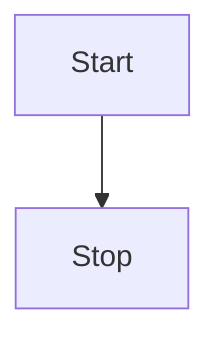
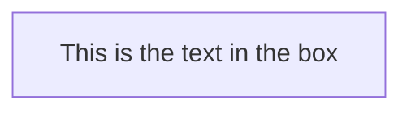
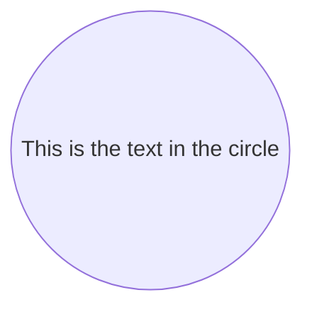
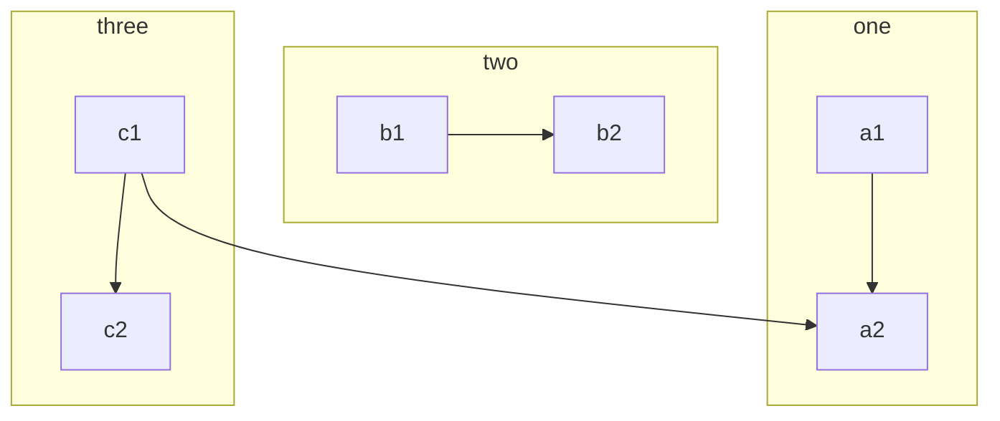
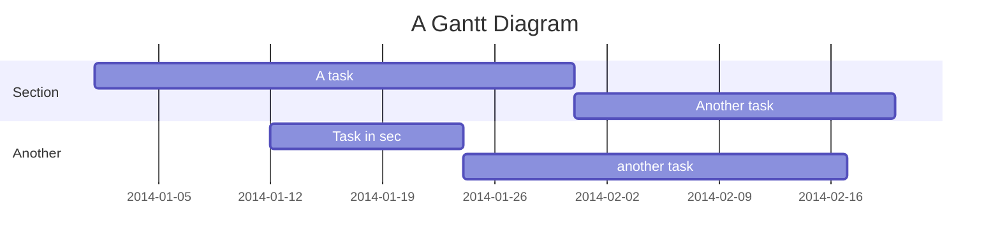

# Markdown Syntax

## Character Formatting

You should read this, it's **very important**.
You _might_ want to read this.
~~Never mind~~ - it wasn't _that_ important.

Let's try a few `combinations`:
**This text is strong, ~~this text is strong with strikethrough~~, and _this text is formatted with strong emphasis_**
***This text is formatted with strong emphasis too.***


## Headings

# Heading 1
## Heading 2
### Heading 3
#### Heading 4
##### Heading 5
###### Heading 6

Heading 1 - Alternative Syntax
========

Heading 2 - Alternative Syntax
--------


## Paragraphs and Line Breaks

Even though this text is written on two separate lines,
it is parsed as a single paragraph.

This paragraph is separated from the previous paragraph
by a blank line.

This text is parsed as a single paragraph.
The two trailing spaces at the end of the previous line start a new line.\
The backslash character also starts a new line.


## Thematic Breaks

The underscores on the next line create a thematic break below this paragraph.
___
The minus signs below must be separated from this paragraph by a blank line.
If not, they are parsed as a level 2 heading.

----
Three or more asterisks also create a thematic break.
****


## Block Quotes

> Use block quotes to emulate reply text.
> This line is part of the same quote.

This line is not formatted and does not belong to the quote block.

> This block spans multiple paragraphs.
>
> The second paragraph is grouped with the previous paragraph in the same quote block.
> Character formatting is _also_ supported inside the **quote block**.

> Quote blocks can also be nested.
>> When you start a new line with additional > characters,
>>> it simulates a threaded conversation.


## Indented Code Blocks

Start an indented code block following a paragraph with a blank line and at least four spaces of indentation:

    This is a code block.

    Blank lines between indented lines do not end the code block.

    Here is some HTML:
        <div class="footer">
            © 2009—2017 JetBrains · All rights reserved
        </div>
This line of text is not indented. It ends the code block and starts a new paragraph.


## Fenced Code Blocks

The following code block uses syntax highlighting for Python:
``` python
@requires_authorization
def somefunc(param1='', param2=0):
    '''A docstring'''
    if param1 > param2: # interesting
        print 'Greater'
    return (param2 - param1 + 1) or None
class SomeClass:
    pass
>>> message = '''interpreter
... prompt'''
```

## Lists

The following list **must** begin with the number 1:
1. Only lists that start with 1 are allowed to interrupt paragraphs.
1. Subsequent numbering is irrelevant.
0. You can start a new line with any number as long as you use the same delimiter character.
2) This item uses a different delimiter and starts a new ordered list, starting with the number 2.

This list can start with any number:

4) The empty line means that the list does not interrupt a paragraph.
1) The ordered list continues to increment the numbering from the previous list item.
5) Use any number fewer than ten characters. This number is parsed as the third item in the ordered list.

* Start unordered lists with -, *, or +.
+ You don't even have to use the same character for each list item.
- Pro tip: * and + require the Shift key. - doesn't. Format faster with the minus sign.
  * Nest unordered list items with two spaces.
    * Unordered lists support multiple levels of nesting.


## Checklists

TODO:
* [x] This item is marked as complete. The checkbox is checked.
- [ ] This item is incomplete. The checkbox is unchecked.
+ [ ] As with unordered lists, you can start the line with an asterisk, minus sign, or plus sign.
    - [ ] Nest checklist items with two spaces.
        -  [ ] Checklists support multiple levels of nesting.


## Tables


Kitchen Cleanup Rotation

| Month    | Assignee | Backup |
| -------- | -------- | ------ |
| January  | Dave     | Steve  |
| February | Gregg    | Karen  |
| March    | Diane    | Jorge  |

Here's the same text with additional formatting and alternative syntax.
+ The text in the first column is flush right.
+ The text in the second column is centered.
+ The Markdown is stripped down to the minimum syntax that is required to render the table.

Month | Assignee | Backup
---:|:---:| ---
**January** | Dave | _Steve_
**February** | Gregg | _Karen_
**March** | Diane | _Jorge_


## Links

[inline link](https://www.google.com)
[inline link with tooltip](https://www.google.com "google")
[reference link][1]

[1]: https://www.google.com


## Images

Here's an image link to the logo:


## LaTeX

The editor converts LaTeX equations in double-dollars `$$`: $$ax^2+bx+c=0$$. All equations are rendered as block equations. If you need inline ones, you can add the prefix `\inline`: $$\inline p={1\over q}$$. But it is a good practice to place big equations on separate lines:

$$
x_{1,2} = {-b\pm\sqrt{b^2 - 4ac} \over 2a}.
$$

In this case the LaTeX syntax will be highlighted in the source code. You can even add equation numbers (unfortunately there is no automatic numbering and refs support):

$$
|\vec{A}|=\sqrt{A_x^2 + A_y^2 + A_z^2}.
$$(1)


## flowchart

```flow
st=>start: Start
e=>end
op=>operation: My Operation
cond=>condition: Yes or No?

st->op->cond
cond(yes)->e
cond(no)->op
```

## sequence

[Documentation for sequence](https://bramp.github.io/js-sequence-diagrams/)


```sequence
Alice->Bob: Hello Bob, how are you?
Note right of Bob: Bob thinks
Bob-->Alice: I am good thanks!
```

```seq
Title: Here is a title
A->B: Normal line
B-->C: Dashed line
C->>D: Open arrow
D-->>A: Dashed open arrow
```


## G2

[Documentation for G2](http://g2.alipay.com/)

```g2
const data = [
    { genre: 'Sports', sold: 275 },
    { genre: 'Strategy', sold: 115 },
    { genre: 'Action', sold: 120 },
    { genre: 'Shooter', sold: 350 },
    { genre: 'Other', sold: 150 }
];

const chart = new G2.Chart({
    forceFit: true,
    container: container,
    height : 300
});
chart.source(data);
chart.interval().position('genre*sold').color('genre')
chart.render();

return chart;
```


## Charts

[Documentation for charts](http://www.chartjs.org/docs/)

### Line Chart

```chart
{
  "type": "line",
  "data": {
    "labels": [
      "January",
      "February",
      "March",
      "April",
      "May",
      "June",
      "July"
    ],
    "datasets": [
      {
        "label": "# of bugs",
        "fill": false,
        "lineTension": 0.1,
        "backgroundColor": "rgba(75,192,192,0.4)",
        "borderColor": "rgba(75,192,192,1)",
        "borderCapStyle": "butt",
        "borderDash": [],
        "borderDashOffset": 0,
        "borderJoinStyle": "miter",
        "pointBorderColor": "rgba(75,192,192,1)",
        "pointBackgroundColor": "#fff",
        "pointBorderWidth": 1,
        "pointHoverRadius": 5,
        "pointHoverBackgroundColor": "rgba(75,192,192,1)",
        "pointHoverBorderColor": "rgba(220,220,220,1)",
        "pointHoverBorderWidth": 2,
        "pointRadius": 1,
        "pointHitRadius": 10,
        "data": [
          65,
          59,
          80,
          81,
          56,
          55,
          40
        ],
        "spanGaps": false
      }
    ]
  },
  "options": {}
}
```


[Documentation for Line Chart](http://www.chartjs.org/docs/#line-chart)

### Bar Chart

```chart
{
  "type": "bar",
  "data": {
  "labels": [
    "Red",
    "Blue",
    "Yellow",
    "Green",
    "Purple",
    "Orange"
  ],
  "datasets": [
    {
    "label": "# of Votes",
    "data": [
      12,
      19,
      3,
      5,
      2,
      3
    ],
    "backgroundColor": [
      "rgba(255, 99, 132, 0.2)",
      "rgba(54, 162, 235, 0.2)",
      "rgba(255, 206, 86, 0.2)",
      "rgba(75, 192, 192, 0.2)",
      "rgba(153, 102, 255, 0.2)",
      "rgba(255, 159, 64, 0.2)"
    ],
    "borderColor": [
      "rgba(255,99,132,1)",
      "rgba(54, 162, 235, 1)",
      "rgba(255, 206, 86, 1)",
      "rgba(75, 192, 192, 1)",
      "rgba(153, 102, 255, 1)",
      "rgba(255, 159, 64, 1)"
    ],
    "borderWidth": 1
    }
  ]
  },
  "options": {}
}
```


## mermaid

[Documentation for mermaid](https://mermaidjs.github.io/)



-----




-----




-----




-----




